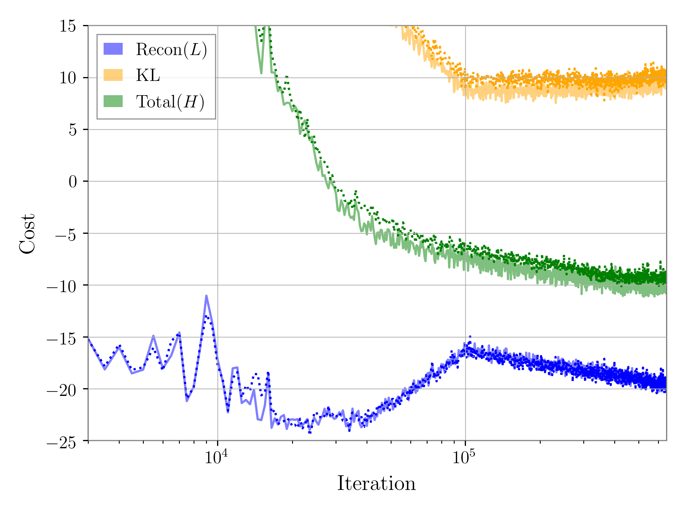
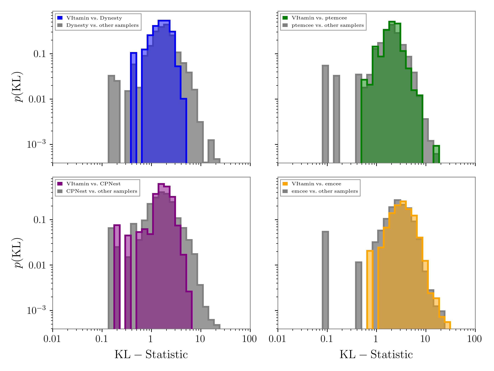

[](https://badge.fury.io/py/vitamin-b)


# [VItamin_B: A Machine Learning Library for Fast Gravitational Wave Posterior Generation](https://arxiv.org/abs/1909.06296)
:star: Star us on GitHub  it helps!

Welcome to VItamin_B, a python toolkit for producing fast gravitational wave posterior samples.

This [repository](https://github.com/hagabbar/vitamin_b) is the official implementation of [Bayesian Parameter Estimation using Conditional Variational Autoencoders for Gravitational Wave Astronomy](https://arxiv.org/abs/1909.06296).

Hunter Gabbard, Chris Messenger, Ik Siong Heng, Francesco Tonlini, Roderick Murray-Smith

Official Documentation can be found at [https://hagabbar.github.io/vitamin_b](https://hagabbar.github.io/vitamin_b).

Check out our Blog (to be made), [Paper](https://arxiv.org/abs/1909.06296) and [Interactive Demo](https://colab.research.google.com/github/hagabbar/OzGrav_demo/blob/master/OzGrav_VItamin_demo.ipynb).

Note: This repository is a work in progress. No official release of code just yet.

## Requirements

VItamin requires python3.6. You may use python3.6 by initializing a virtual environment.

```
virtualenv -p python3.6 myenv
source myenv/bin/activate
pip install --upgrade pip
```

Optionally, install `basemap` and `geos` in order to produce sky plots of results.

For installing basemap:
- Install geos-3.3.3 from source
- Once geos is installed, install basemap using `pip install git+https://github.com/matplotlib/basemap.git`

Install VItamin using pip:
```
pip install vitamin-b
```

## Training

To train an example model from the paper, try out the [demo](https://colab.research.google.com/github/hagabbar/OzGrav_demo/blob/master/OzGrav_VItamin_demo.ipynb).

Full model definitions are given in `models` directory. Data is generated from `gen_benchmark_pe.py`.

## Results

We train using a network derived from first principals:


We track the performance of the model during training via loss curves:


Finally, we produce posteriors after training and other diagnostic tests comparing our approach with 4 other independent methods:

Posterior example:


KL-Divergence between posteriors:


PP Tests:

